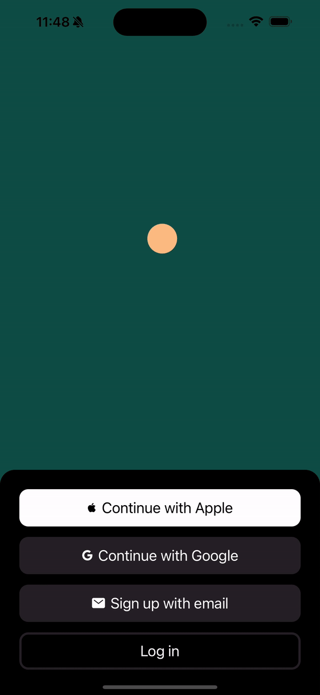
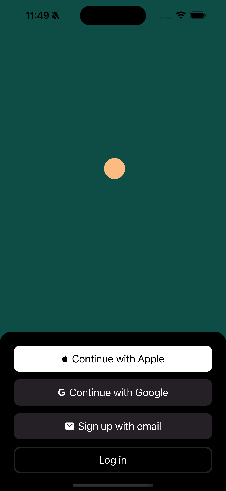
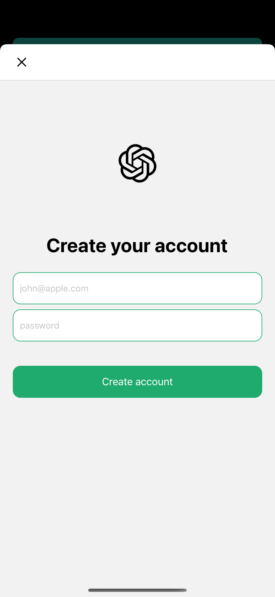
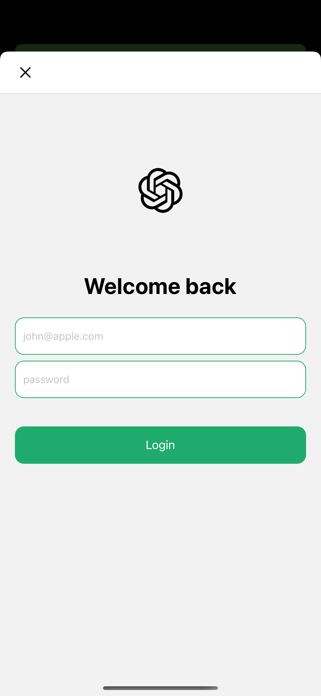
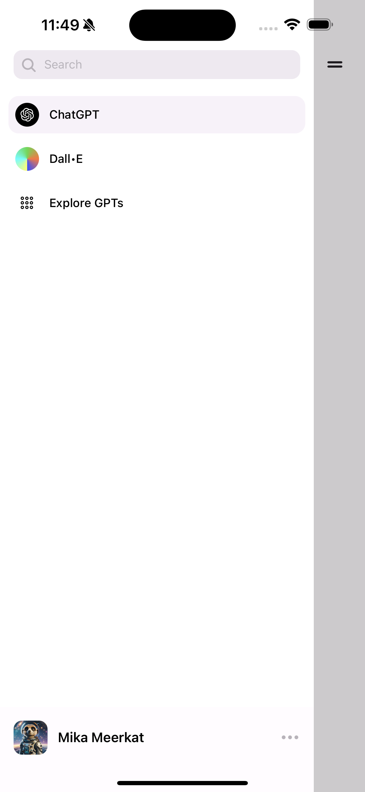
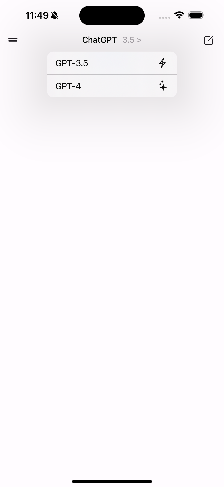
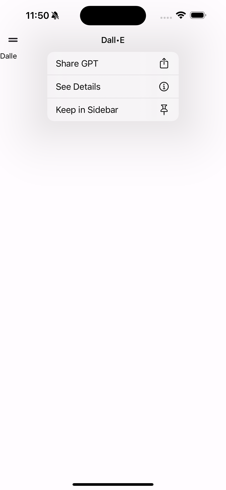

# ChatGPT Clone

This is a clone of ChatGPT application built to learn and implement Expo Prebuild.

The Project Consists of the following implementations:

- Expo Prebuild for Native Functionality
- Clerk For Authentication
- Expo Router For Routing
- Native Dropdown and Context Menu using [Zeego](https://zeego.dev/)
- RN Redash for Animation
  and more...

### Screenshots

More Commits and Screenshots will be added soon ...